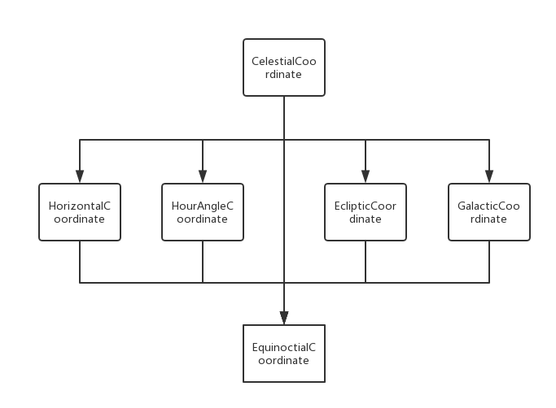

# CelestialCoordinate

## 简介

CelestialCoordinate 是一个基于 NodeJS 开发的天文学坐标计算工具，主要可被用于天体天球坐标的转换和处理。

其中包含的天球坐标组件分别有：

* [HorizontalCoordinate](./doc/HorizontalCoordinate.md) 天球地平坐标
* [HourAngleCoordinate](./doc/HourAngleCoordinate) 天球时角坐标（也称第一赤道坐标）
* [EquinoctialCoordinate](./doc/EquinoctialCoordinate) 天球赤道坐标
* [EclipticCoordinate](./doc/EclipticCoordinate) 天球黄道坐标
* [GalacticCoordinate](./doc/GalacticCoordinate) 天球银道坐标

*点击上述链接，可进入它们的详细文档。*

类 CelestialCoordinate 是上述五种天球坐标的更高层次封装，建议在涉及到多种天球坐标转换的情况下直接使用它。

## 安装

通过 npm 安装，在你的 node 项目目录下执行：

`npm install @behaver/celestial-coordinate`

安装完成后，调用即可：

`const { CelestialCoordinate } = require('@behaver/celestial-coordinate');`

## 用例

```js
const { JDateRepository } = require('@behaver/jdate');
const { CelestialCoordinate } = require('@behaver/celestial-coordinate');

// 创建天球坐标，通过天球赤道系统
// 第二个参数为观测参数，被用于地平和时角坐标的转换
let cc = CelestialCoordinate.equatorial({
  epoch: new JDateRepository(2000.0, 'jepoch'), 
  ra: 123.4567,
  dec: 54.321,
  radius: 1.234,
  withNutation: true,
}, {
  time: new JDateRepository(2462088.69, 'jde'),
  geoLong: 120.3456,
  geoLat: 30.4567,
});

// 获取天球赤道坐标的赤经角对象
let ra = cc.equatorial.ra;

// 获取天球地平坐标的方位角对象
let a = cc.horizontal.a;

// 获取天球黄道坐标的黄纬角对象
let b = cc.ecliptic.b;

// 获取天球银道坐标的银经角对象
let l = cc.galactic.l;
```

## 类图



## API

`static horizontal(options, ob_options)`

基于地平系统实例化天球坐标

* options 坐标系统参数
* ob_options 观测参数

`static hourAngle(options, ob_options)`

基于时角系统实例化天球坐标

* options 坐标系统参数
* ob_options 观测参数

`static equinoctial(options, ob_options)`

基于赤道系统实例化天球坐标

* options 坐标系统参数
* ob_options 观测参数

`static ecliptic(options, ob_options)`

基于黄道系统实例化天球坐标

* options 坐标系统参数
* ob_options 观测参数

`static galactic(options, ob_options)`

基于银道系统实例化天球坐标

* options 坐标系统参数
* ob_options 观测参数

`from(options, ob_options)`

设定起始天球坐标

* options 坐标系统参数
* ob_options 观测参数

`changeObserver(options)`

设置观测参数

* options.time 观测历元
* options.geoLong 观测点地理经度
* options.geoLat 观测点地理纬度

`clearCache()`

清除坐标实例缓存

`set horizontal(horizontal)`

设定 天球地平坐标对象

`get horizontal()`

获取 天球地平坐标对象

`set hourAngle(hourangle)`

设定 天球时角坐标对象

`get hourAngle()`

获取 天球时角坐标对象

`set equinoctial(equinoctial)`

设定 天球赤道坐标对象

`get equinoctial()`

获取 天球黄道坐标对象

`set ecliptic(ecliptic)`

设定 天球黄道坐标对象

`get ecliptic()`

获取 天球黄道坐标对象

`set galactic(galactic)`

设定 天球银道坐标对象

`get galactic()`

获取 天球银道坐标对象

`get obTime()`

获取 观测时间

`get obGeoLong()`

获取 观测点地理经度

`get obGeoLat()`

获取 观测点地理纬度

## 许可证书

The MIT license.